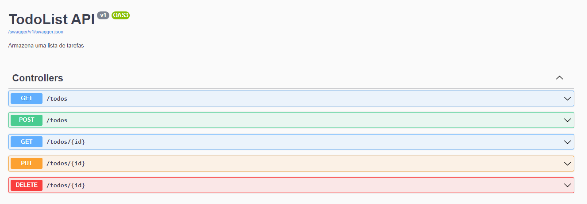
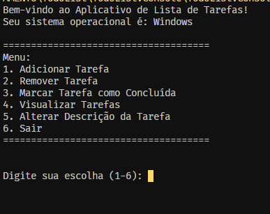

# TodoList API

## Imagens do Projeto funcionando
### Console

### API Swagger


## 📖 About

O TodoList é um CRUD(Create, Read, Update, Delete), foi uma atividade de um Treinamento do universo .NET, e está aplicação,utiliza as tecnologias .NET 8, SQLite e Entity Framework Core.

## 🧱 Tecnologias 

- [.NET 8](https://dotnet.microsoft.com/pt-br/download/dotnet/8.0)
- [SQLite](https://www.sqlite.org/index.html)
- [Entity Framework Core](https://github.com/dotnet/efcore)

## 🚶‍♂️ Como instalar e utilizar

1. Clonar o Repositório
2. Entrar na pasta do projeto `cd TodoList`
3. Instalar o Entity Framework Core `dotnet tool install --global dotnet-ef`
> Se esta for a primeira vez que você executa o projeto, execute migration Atualizar banco de dados
```bash
dotnet ef migrations add MigraçãoInicial --startup-project .\TodoList.Api\TodoList.Api.csproj --project .\TodoList.Core\TodoList.Core.csproj 

dotnet ef database update --startup-project .\TodoList.Api\TodoList.Api.csproj --project .\TodoList.Core\TodoList.Core.csproj

```
4. Compilar API
```bash
cd TodoList.Api
dotnet run
```
5. Executar o console
```bash
cd TodoList.Console.Console
dotnet run
```
